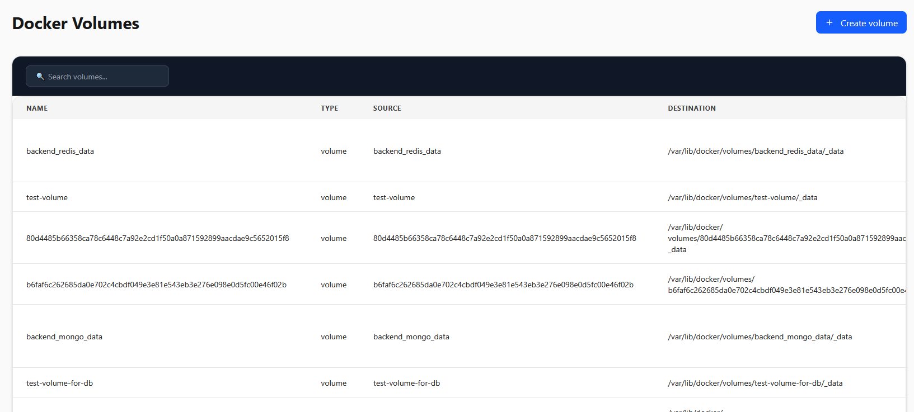

# 🐳 Docker Manager

**Docker Manager** web-based interface built using **Python (FastAPI)** and **React** that allows to manage Docker containers, images, networks, and volumes from browser.

### **Current Status:** ❌ **Is it perfect?** NO  but basics work❌

## 🔧 Features

- Pull Docker images with progress tracking
- Create, start, stop, and delete containers
- View container logs and resource usage (CPU, RAM, network, disk I/O)
- Create and manage Docker volumes
- Assign volumes to containers
- Create and manage custom Docker networks
- Attach containers to networks
- Stream terminal access to containers (via WebSocket + xterm.js)
- View live Docker metrics and warnings
- Network map showcasing how containers and networks are connected

## 🔧 Planned Features (version 2.0)
- Better container control and data fetching
- Tests for frontend and mobile version
- Asynchronous backend (Synchronous as of now)
- Backend docker fallback catch system for easier error identification
- Docker and Container logs 
- Seperate Frontend and Backend for remote connection and overall control of docker

## 🔧 Planned Features (version 3.0)
- Backend rewrite in C/C++ or Rust
- Kubernetes support
- Docker Swarm support

### Tech Stack

| **Platform** | **Tech** |
|--------------|------------------|
| **Web**      | React, TailwindCSS, Xterm.js |
| **Mobile**   | Python, PyTests, Docker SDK, FastAPI |

## 🖼️ UI Preview

Each image highlights a specific section of the application, such as the container list, image puller, volume manager, or terminal interface.

Below is a gallery of screenshots from the Docker Manager UI, located in the `/images` directory:

---

> Made with ❤️ using FastAPI, Docker SDK, React, and xterm.js.
